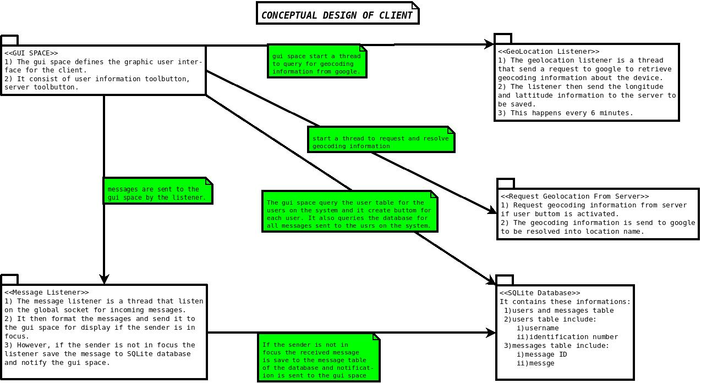

# Client
This is the client codebase for iCOM system. iCOM is an internal communication system that is designed to service the communication needs of organizations through the use of a concurrent server which runs on any unix-like system and a client that can be run on any other operating system used by the organization.


## Setup
#### Prerequisites
* Python3
* MySQL
* SQLite
* GTK+3, PyGObject

* [Follow the guide here](https://pygobject.readthedocs.io/en/latest/getting_started.html) on how to install pygobject on your platform.

To run:

```
$ pip install -r requirement.txt
$ cd client
$ ./main.py
```
